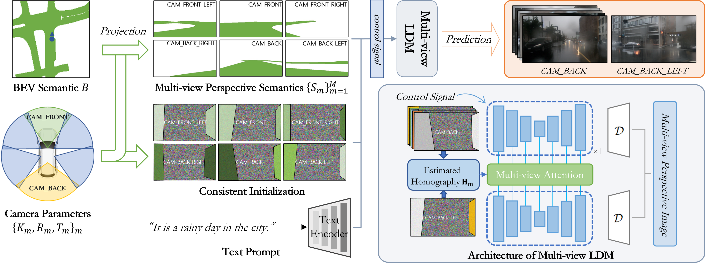
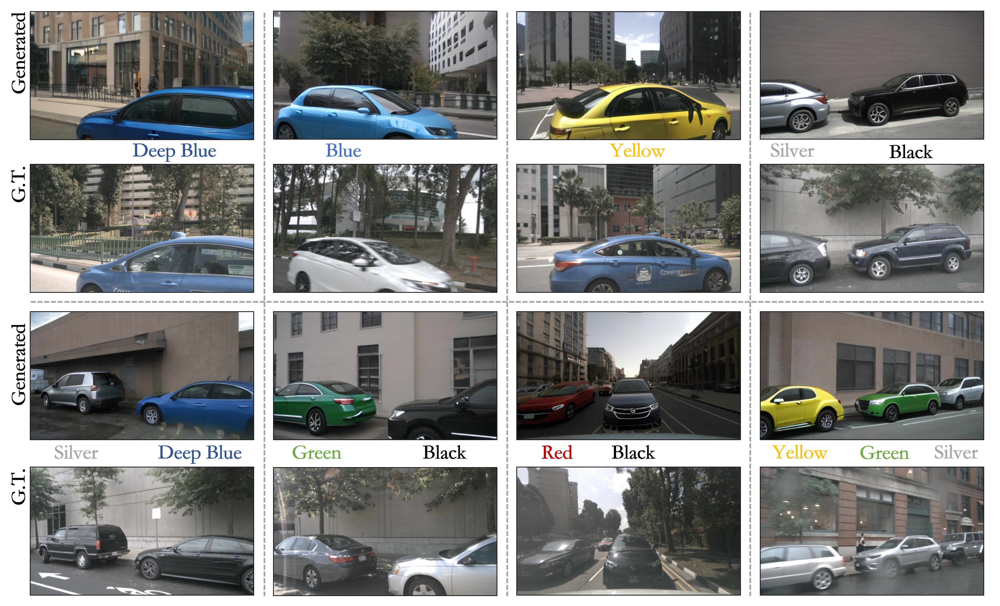
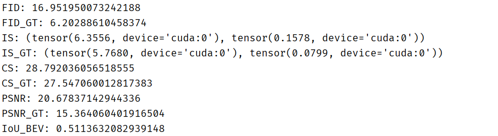

# [MVPbev](dummy_paper_link)
> Multi-view Perspective Image Generation from BEV with Test-time Controllability and Generalizability (*ACM MM24, Poster*)

### *Abstract*
*This work aims to address the multi-view perspective RGB generation from text prompts given Bird-Eye-View(BEV) 
semantics. Unlike prior methods that neglect layout consistency, lack the ability to handle detailed text prompts,
or are incapable of generalizing to unseen view points, MVPbev simultaneously generates cross-view consistent 
images of different perspective views with a two-stage design, allowing object-level control and novel view 
generation at test-time. Specifically, MVPbev firstly projects given BEV semantics to perspective view with 
camera parameters, empowering the model to generalize to unseen view points. Then we introduce a multi-view 
attention module where special initialization and denoising processes are introduced to explicitly enforce local 
consistency among overlapping views w.r.t. cross-view homography. Last but not the least, MVPbev further allows 
test-time instance-level controllability by refining a pre-trained text-to-image diffusion model. Our extensive 
experiments on NuScenes demonstrate that our method is capable of generating high-resolution photorealistic images
from text descriptions with thousands of training samples, surpassing the state-of-the-art methods under various 
evaluation metrics. We further demonstrate the advances of our method in terms of generalizability and 
controllability with the help of novel evaluation metrics and comprehensive human analysis. Our code and model 
will be made available.*

------------------------

### *Overview*


------------------------


-----------------------


## 🔮 *Get Started*
### 1.0 Environment Setup 
- Use `pip install -r requirements.txt` to install all dependencies. Notably, **make sure** `torch.__version__ >= 2.1.0`.
### 1.1 Create Dataset
You should build a dataset for this project based on NuScenes dataset, or you can [download](#resources) datasets that we've already created.
If you make it right, the dataset should be organized as following structure which is pretty simple:

```
.
└── DATASET-PATH/
    ├── train.csv
    ├── valid.csv
    └── data/
        ├── [TOKEN].pt (≈10MB)
        └── ...
```
Here are some guidance to create this dataset on your own:
- Get to target folder `cd ./create_dataset`
- **Optional & Not recommend:** Compile Cython code with `sh ./scripts/cybfs_setup.sh`. You can extract some extra data 
wiht this enabled, but that's not really used in our final version.
- Configure your dataset through `config.py`.
- Run it by `python build_dataset.py` which typically takes over 20 hours (by default). 

> [!TIP]
> There's a known & unsolved [issue](https://github.com/nutonomy/nuscenes-devkit/issues/1018) in NuScenes. If you found the time 
spent in processing different samples are of huge gap, that's normal.

### 2. Train
- First, `cd ./scripts/py_scripts`, we provide several python scripts here, and you can have all jobs done here.
- Make sure those pretrained models (SD, Controlnet, etc.) in HuggingFace are available for you. **Optional**: You can 
download all models we need to local (`MVPbev/weights/pretrained`) by `python download_pretrained.py`. You can configure 
which way you prefer (load pretrained model from local or remote) in `MVPbev/configs/*.py`
- **Step 1.** We finetune pretrained Stable Diffusion to be able to generate stree-view images. Start finetuning by 
`python train.py --s 0 --n [EXP_NAME]`, the training program will update some test results and checkpoints saved in 
`MVPbev/logs/[EXP_NAME]`(auto created). 
- **Step 2.** Train Multi-view Attention Module by `python trian.py --s 1 --n [EXP_NAME]`.
- Please note we finetune SD only while leave Controlnet untouched.
- You can always modify concrete training setups in config file `MVPbev/finetune_SD.py` and `MVPbev/train_MVA.py`.
> [!NOTE]
> Please note that we only implemented model training for 1 GPU case (memory > 40GB is recommended, or you can enable gradient 
accumulation in config file). **If you're interested in implementing multi-GPU training for this project and want to contribute
to this repo, do not hesitate to open an issue, and I'm happy to help you with that.**
### 3. Test
- Configure path to your model checkpoint to be tested in config file `MVPbev/configs/test_config.py`.
- `cd ./scripts/py_scripts` and `python test.py --n [EXP_NAME]`, this will test your model in valid set (you can set how 
many samples you want to use in config file).
- All test results will be saved to `MVPbev/test_output` (auto created).
- You can look through generated samples in `MVPbev/test_output/test_results/sample_*.pt`, which is a dict.
- Load and browse generated results with `torch.load()`.

### 4. Evaluate
- Clone [CVT](https://github.com/bradyz/cross_view_transformers) code to local and organize it as following structure. 
You need a pretrained CVT weight (you can directly download the CVT checkpoint we trained) and download labels: 
[cvt_labels_nuscenes_v2](https://www.cs.utexas.edu/~bzhou/cvt/cvt_labels_nuscenes.tar.gz).
```
.
├── cross_view_transformers/
│   ├── ...
│   └── model.ckpt
├── cvt_labels_nuscenes_v2/
│   ├── scene-*
│   └── ...
└── MVPbev/
    └── ...
```
- If your files are in same structure as above, you can simply evaluate your model by `python evalute.py --n [EXP_NAME]`, 
which will compute all metrics used in our paper, or you need pass two extra params: `python evaluate.py --n [EXP_NAME] 
--cvt_code_path [PATH_TO_CVT_CODE] --cvt_ckpt_path [PATH_TO_CVT_CKPT]`.
- All generated samples in `MVPbev/test_outputs/[EXP_NAME]` will be evaluated, and you will see something like this:

&emsp; 

### 5. Multi-instance Control
- We demonstrated how to use our training-free instance control via a [notebook](multi_objs_color_control/multi_obj_control.ipynb)
in `MVPbev/multi_objs_color_control`, including usages in detail and implementation of all our evaluation metrics.
- You can also see a csv [file](multi_objs_color_control/selected_views.csv) in that dir, that's a list of test samples
we used in our paper. ⚠️ But, please note not all data in that list exist in dataset we provided now. Becauese, in this new version, we
expanded our dataset by set `min_gap_distance=8` in [config](create_dataset/config.py) file to sample more data. The old version of dataset that
contains all those samples is not compatible to this version of code. In this way, we can not directly share that to you. So, if you want to test on
all those samples, please re-build dataset with setting `min_gap_distance=10`, or you can generate those specific samples only since you've
already known their tokens. It's a smarter way but requires coding for a little bit, or you can simply set `LOAD_MISSING=True` in the notebook, you'll
need full NuScenes dataset in your device in that case.

-----------------------------
## *Resources*
### 📑 Pretrained Weights

- [MVPbev Checkpoints](https://mega.nz/folder/KIsGjZQC#HCblF2a-3O_OBiJ1m5vThQ)
- [Pretrained CVT model](https://mega.nz/folder/bNcFnSzJ#STMbFa1uM0V-iC5d-f_Upg) (for evaluation)

### 👜 Ready-to-use Dataset

- You can directly use our created [dataset](https://sharedby.blomp.com/yE2FCo)
(≈15 GB zipped, contains ≈10,000 Sets × 4MB ≈ 40GB).

## *Credit*
We originally implemented this project basing on following repos:
- [MVDiffusion](https://github.com/Tangshitao/MVDiffusion): Stable Diffusion training & inference, CAA implementation.
- [Diffusers](https://github.com/huggingface/diffusers): Stable Diffusion + Controlnet forward code.
## *Citation*
[TO-BE-UPDATED]
